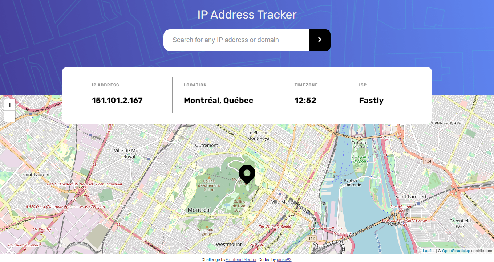
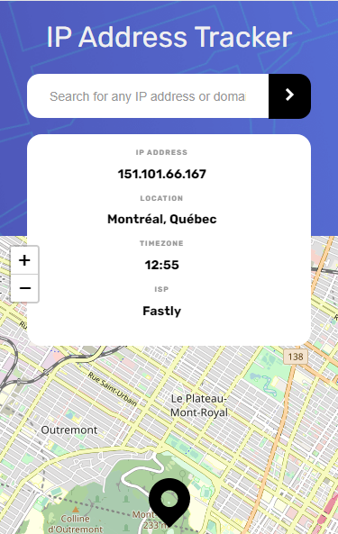

# Frontend Mentor - IP address tracker solution

This is a solution to the [IP address tracker challenge on Frontend Mentor](https://www.frontendmentor.io/challenges/ip-address-tracker-I8-0yYAH0). Frontend Mentor challenges help you improve your coding skills by building realistic projects.

## Overview

### The challenge

Users should be able to:

- View the optimal layout for each page depending on their device's screen size
- See hover states for all interactive elements on the page
- See their own IP address on the map on the initial page load
- Search for any IP addresses or domains and see the key information and location

### Screenshot

Other previews [here](/solutions)

### Links

- Solution URL: [here](https://github.com/giuse92/ip-address-tracker)
- Live Site URL: [here](https://giuse92.github.io/ip-address-tracker)

## My process

### Built with

- Semantic HTML5 markup
- CSS custom properties
- Mobile-first workflow
- [React](https://reactjs.org/) - JS library
- [React Leaflet](https://react-leaflet.js.org/) - React components for Leaflet maps

## Author

- Frontend Mentor - [@giuse92](https://www.frontendmentor.io/profile/giuse92)
